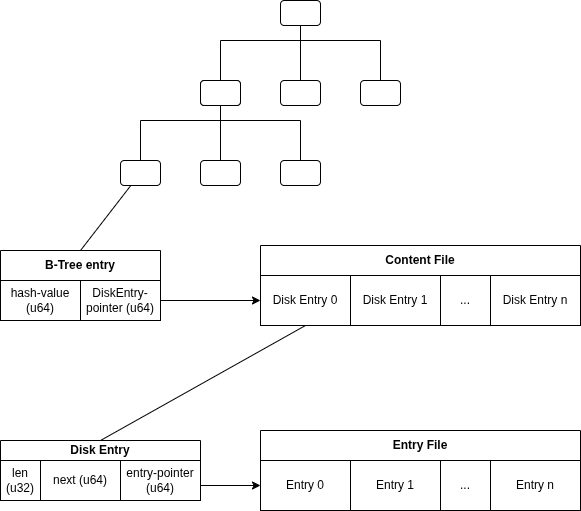

# Disk Based Hash Index

A proof of concept for a new approach to database indexing for variable length data.

## Motivation
Variable length Btree-indexing is annoying. 
While slotted pages make it easier, it is far from a perfect solution.

Hash-indexing is better in that regard. 
However, most hash-indices require to read the entire hash-array into memory.
So hash indices are not perfect either.

While I don't claim that this approach is perfect whatsoever, 
it does solve some of the complexities introduced by traditional Btree-indexing
by using techniques from hash-indexing.

## How it works
The base of this approach is a regular Btree.
That Btree is ideally written to disk and its nodes are read incrementally as the traversal goes down from the root onwards*, resulting in log(n) many reads.
The Btree's nodes store the fixed-length hashes of keys inserted 
(with the keys being variable-length data**).
The keys themselves are never stored explicitely, 
they are expected to be stored already in the entry, which the key is associated with.
The content-file is a file to which data structures known as DiskEntries are appended.

### Components
- Btree: Holds fixed-size-nodes of a hash-value and an offset to a DiskEntry in the content-files.
- Content-file: Append-only file of DiskEntries (fixed-sized).
- DiskEntries: Datastructure that holds the offset to the actual entry*.

*This entry is a u64 in the POC. 
It can be an arbitrary (fixed-size) value that is interpreted by the storage engine.

### Collisions are expected
Using a hash function will inevitably lead to collisions. 
However, the number of collisions are expected to be relatively small.
That is, under the assumption that an appropriate hash-function is applied, 
the number of collisions will be small enough to be negligable for performance measurement.
For this POC, a u64 is chosen as the type of the hash-value. 
Smaller values are possible, but it should be ensured that enough bits are provided.
(For example, with 10⁶ entries, choosing an 8-bit hash-type will yield terrible performance.)

### Handling collisions
While the number of collisions are expected to be small, they still can (and with a large enough input, will) happen,
so they need to be handled.
This POC handles collisions with linked lists and using unique properties of hashes.
 
Each hash in the Btree holds an offset to a DiskEntry in a content-file.
This DiskEntry holds the offset to the entry in the entries-file. 
But it also holds an offset called 'next' in the same content-file. 
This 'next' offset builds a linked list to the next DiskEntry with the same hash-value.
That means that all hashes that collide are stored in a linked list.
When during an insertion-operation, the engine notices that a hashed key is already present in the Btree,
It will append the offset to the new DiskEntry to the linked list. 
This means that there will be no modifications to the Btree itself when a collided value is inserted.
The only modifications made are to the content-file (the last DiskEntry must point to the newly appended DiskEntry).

* Note that for the POC in this repo, the Btree still sits in memory.
** For the POC, only strings are supported. 
However, since strings are just an array of bytes, this would work well for any BLOB.

## Trade-offs and ciriticism
- Changing hash function results in fully invalid, hard to recover state. 
This is dangerous because the values are not stored with the offset in the content-file.
But, with proper version control, it is quite the challenge to lose the original hash function.
If that is not the case, a migration to a different hash function is possible but still expensive.
- Range queries are not supported (other than full-table scans). 
Neither are pattern matching (e.g. "LIKE 'front%s'").
- Deletion and Updates are supported, but they leave space in the content-file. 
Since the amount of disk space that they occupy is very small (about 20 bytes per entry),
that aspect is negligable. It can of course be tackeled by keeping track of freed spaces, 
what would yield the content-file to no longer be append-only.
- Same length values may still lead to hash-collisions. 
So this case may still require a traversal of the entire collisions-linked-list.

