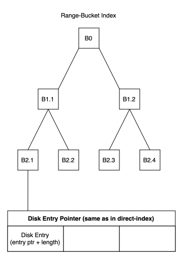

# Extensions
Possible new features and extensions of the previous design are collected here.
These are mostly abstract thoughts of the author.

## Enabling range-queries
One of the biggest criticism of the current design is, that it only enables direct matching.
Range queries such as "WHERE s.ends_with('suffix')" or "WHERE s.starts_with('prefix')" are not supported as of now.
To enable them, the main structure should remain roughly the same, 
as major changes to it would yield in a loss of the benefits for which the design has been chosen. 
A data-structure added to the current design would have a very nice side effect 
in that it enables the storage engine to have the option of choosing to support range queries.
The range-index could be added/deleted without effecting the primary direct-index.

### Possible approaches to range-indexing
(Now it's getting really abstract. The following section is to be taken, not only with a grain, but a whole mine of salt.)
#### Pre- and Suffix-Indexing
Having an index-structure that keeps track of both the first and the last n-characters 
(or bytes; characters are used here because string-indexing is a very graspable example) of an entry. 
This structure then references to the entry on disk. 
Similar to bucket-sorting algorithms, values are categorized (by their starting and ending characters) 
and stored as references in buckets.
This keeps the structure modular (range and direct indices are separate; adding/deleting one leaves the other unchanged)
while enabling range-queries.
However, the downside is that block-reads are not really an option because the entries on disk are not stored sequentially 
(rather they are stored in a random order with the index-structure providing the sorting). 
Therefore, range-queries will always be slower than they are in B+Trees 
(as the data-entries are sorted and multiple entries might be stored on a single block). 
The upside is, that heuristics (for indices of the type STRING) may provide performance benefits: 
Depending on the language, different characters and character-sequences are more common than others.
If that is known by the developer or user of the index-structure, the parameters of 
a) how many characters and 
b) what sequences are stored, 
become highly relevant for the performance when iterating over the index's buckets.
For example, the endings "ing" or "ment" are very common in the english language.
Knowing that, one might either store those exact sequences, resulting in better performance for a small set, 
or store the sequence plus one (or more) characters before it, 
creating a greater granularity and therefore faster queries.

#### Range-Bucket-Index Structure
A radix-tree or trie may be a good fit to store the pre- and suffix-indices.
Since the range-index-structure practically results in a list of offsets that are read from disk, 
this creates the opportunity to schedule the reads such that they are the most performative.
For example, with a block-size of 5, the following reads may be restructured from:
```2@0; 7@10; 1@3; 3@17``` to ```2@0; 1@3; 7@10; 3@17```.
The first one needs 4 separate disk reads (caching disregarded!) with inefficient disk-head-movements.
<br>

<br>
The Disk-Entry structure might need two new fields, range_bucket_idx_prev and range_bucket_idx_next in order to build a linked list for the range index. 
This would break modularity, which is why it might be a good idea for the range-index to reference a separate array of disk-entries, so that modularity stays.
